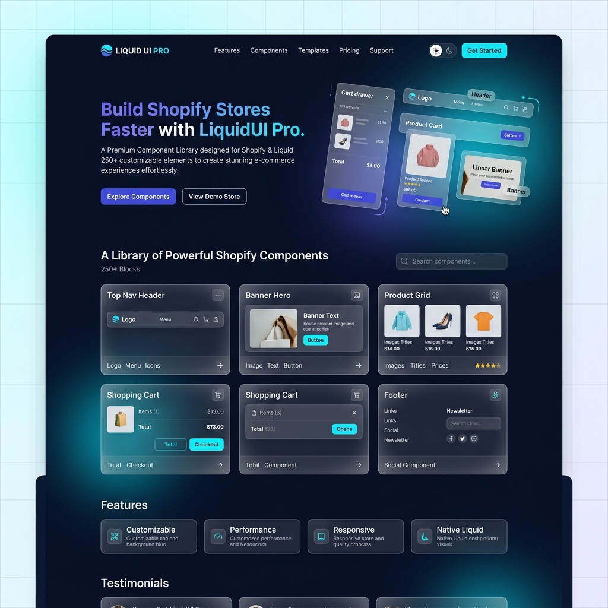

# LiquidUI Pro 🚀

LiquidUI Pro is a premium, production-ready Shopify component library built with **Next.js 16**, **React 19**, and **Tailwind CSS**. It provides over 100 high-fidelity Liquid components designed to help Shopify developers and store owners build stunning storefronts in minutes.



## ✨ Features

- **20+ Premium Cart Components**: From luxury fashion and minimalist designs to high-conversion bento grids and animated interactive drawers.
- **20+ Professional Footer Layouts**: Clean, modern, and high-converting footer designs for various industries.
- **Production Ready**: Fully responsive, optimized for performance, and compatible with the latest Shopify Liquid schema.
- **Modern Tech Stack**: Built with Next.js 16 (Turbopack), React 19, and Tailwind CSS 4.
- **Easy Integration**: Copy-paste Liquid code directly into your Shopify theme.

## 🛍️ Component Categories

### 🛒 Carts (20 New Components)
- **Luxury Fashion**: High-end aesthetic for premium brands.
- **Bento Grid**: Modern, modular layout for high engagement.
- **Glassmorphism**: Sleek, futuristic design with translucent elements.
- **Animated Interactive**: Real-time feedback and smooth transitions.
- **Advanced Conversion**: Optimized for maximum AOV and trust.
- **Eco Organic**: Natural, earthy tones for sustainable brands.
- **Subscription Focus**: Optimized for recurring revenue models.

### 👣 Footers (20 Components)
- **SaaS Modern**: Clean, link-rich layouts for software brands.
- **E-commerce Mega**: Comprehensive navigation for large catalogs.
- **Minimalist**: Subtle, understated designs for boutique stores.
- **Gaming Dark**: High-contrast, neon-accented layouts.

## 🛠️ Tech Stack

- **Framework**: [Next.js 16](https://nextjs.org/) (Canary/Turbopack)
- **Library**: [React 19](https://react.dev/)
- **Styling**: [Tailwind CSS 4](https://tailwindcss.com/)
- **Icons**: [Lucide React](https://lucide.dev/)
- **Animations**: [Framer Motion](https://www.framer.com/motion/)

## 🚀 Getting Started

1. Clone the repository:
   ```bash
   git clone https://github.com/zeeshan912989/LiquidUIPro.git
   ```
2. Install dependencies:
   ```bash
   npm install
   ```
3. Run the development server:
   ```bash
   npm run dev
   ```
4. Open [http://localhost:3000](http://localhost:3000) to browse the library.

## 📜 License

Distributed under the MIT License. See `LICENSE` for more information.

---

Built with ❤️ by [Zeeshan](https://github.com/zeeshan912989)
